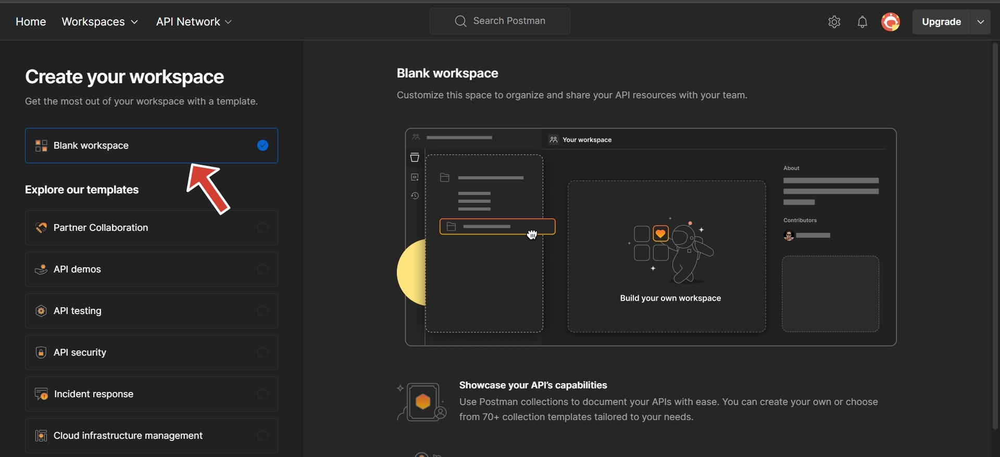
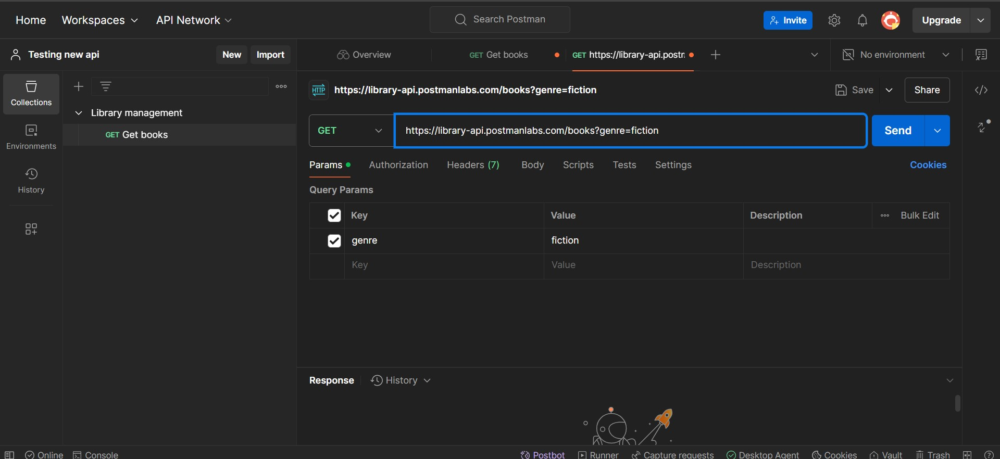

# How to Test APIs: A Step-by-Step Beginner's Guide
Application Programming Interfaces (APIs), allow different applications to communicate easily with one another. API testing ensures they function correctly, providing the correct data and responses. This guide will help you understand the basics of API testing in the simplest way possible.  
### Prerequisites
This article will focus on using Postman to test an API. You will need:
- A Postman account
- A reliable computer
- A stable internet connection
- A basic to intermediate understanding of APIs
## What is API Testing?
Before we begin testing APIs, it is important to understand what it is all about. API testing is a way to check if an API works as expected.
API testing helps answer the following questions:
- Is the API fast?
- Is the API reliable?
- Does the API return the correct data?
- Does the API handle errors properly?

### Tools You Need for API Testing
APIs can be tested manually or with dedicated tools. Here are some popular options:
- cURL: A command-line tool for making HTTP requests.
- Postman: A user-friendly tool for manually testing APIs.

## Before Testing an API
### Understand API Endpoints and HTTP Methods
Knowing API endpoints is essential for anyone who wants to test an API. An API endpoint is like an address where specific data can be accessed. Each endpoint usually includes a base URL and a path. For example:
- Base URL: `https://api.library.com`
- Endpoint: `/books`
  
Both together: `https://api.library.com/books` (retrieves a list of books)

Endpoints use HTTP methods to retrieve or change data. Here are the most common HTTP methods:
- GET: Retrieve data.
- POST: Send data to the server to create something new.
- PUT/PATCH: Update something on the server.
- DELETE: Remove something from the server.

### Read the API Documentation
It is important to read the API documentation for the API you want to test before you begin. The documentation will help you understand the purpose of the API, its endpoints, and their functions.

### Understand Response Codes and Messages
Each request response comes with a status code. Here are common status codes and their meanings:

- 200 OK: The request was successful.
- 201 Created: A new resource was created successfully.
- 400 Bad Request: There was an error with the request.
- 404 Not Found: The resource could not be found.
- 500 Internal Server Error: A server-side issue occurred.

After making a request, check the response status code to ensure it matches the expected result.

### Set Up Your API Testing Environment

All API testing will be done using Postman. First, create an account on [Postman’s website](https://www.postman.com). Then, make sure to [download the Postman agent](https://www.postman.com/downloads/) to your computer. This is essential for a smooth experience using Postman.


### Understand Authentication and Authorization

Authentication is the process of verifying your identity—proving that you are who you claim to be. Common authentication methods include:
- Username and password
- Fingerprint or face recognition (biometric)
- One-time password (OTP) sent to your phone or email
- OAuth providers like Google or Facebook for login

Some APIs require authentication through tokens or keys to access secure data.

Authorization, on the other hand, determines what actions you can perform once your identity is verified. In other words, it defines what you are allowed to do after being authenticated.

Reading the API documentation will guide you on how to obtain an API key or token for accessing specific data and explain what level of access you have after authentication.


## API Testing

Here’s a structured guide to help with API testing in Postman:

### 1. Create a Workspace
- Once you are done registering on Postman, Navigate to the **'Workspaces'** tab and click **'Create Workspace'**.
  
  
  
- Choose the **Blank Workspace** option, then proceed to the next page.
   
  
  
- In the **Create a Workspace** page, name your workspace and set the access to **"Only Me"** (this is for learning purposes, but you can choose other options as needed).

  

### 2. Create a New Request
- Click the **'+'** icon to add a new request.
  

### 3. Test Different HTTP Methods
We will use the following base URL for testing:  
`https://library-api.postmanlabs.com/`

#### GET Request
A GET request retrieves data without changing it.

- Add the URL:  
 `https://library-api.postmanlabs.com/books`
  

- The GET method is selected by default, so no changes are needed.
  
- Click **Send** to run your request.
  

**Response**  
You should receive a response with a list of all books in the database.


- To save the request, click **Save**.
  

  
- Name your request and the collection.
  

#### Another GET Request 
- Click the **'+'** icon next to the previous request to add another one.
- Add the URL:  
  `https://library-api.postmanlabs.com/books?genre=fiction`
 
  
- The GET method is selected automatically. Click **Send** to run your request.

**Response**  
You will receive a response with a list of fiction books in the database.
 

- To save the request, click **Save**.

- Name your request
  

#### POST Request
A POST request sends data to create a new resource.

- Click the **'+'** icon next to the previous request to add another one.
- Change the method to **POST** by clicking the method dropdown.
- Add the URL:  
  `https://library-api.postmanlabs.com/books`
- Click the **Body** tab, select **Raw**, and insert the following JSON to add a new book:
  ```json
  {
    "title": "Americanah",
    "author": "Chimamanda Ngozi Adichie",
    "genre": "fiction",
    "yearPublished": 2013
  }
  ```
 
  
- Click **Send** to run your request.

**Response**  
You may receive a **404** error because authorization is required.
 


**Add Authorization**
- Click on the **Authorization** tab.
- Select **API Key** as the type and add the **key** and **value**.

   
  
- Click **Send** again to resend the request.

**Response**  
You should receive a successful response for adding the new book.
 

- To save the request, click **Save**.
- Name your request.


## Conclusion

API testing ensures that applications work well together and helps you catch errors early on. This article aimed at teaching you the basics of testing an API using Postman. With these basics, you are now equipped to test APIs confidently, ensuring they perform as expected and provide accurate, and reliable data.

